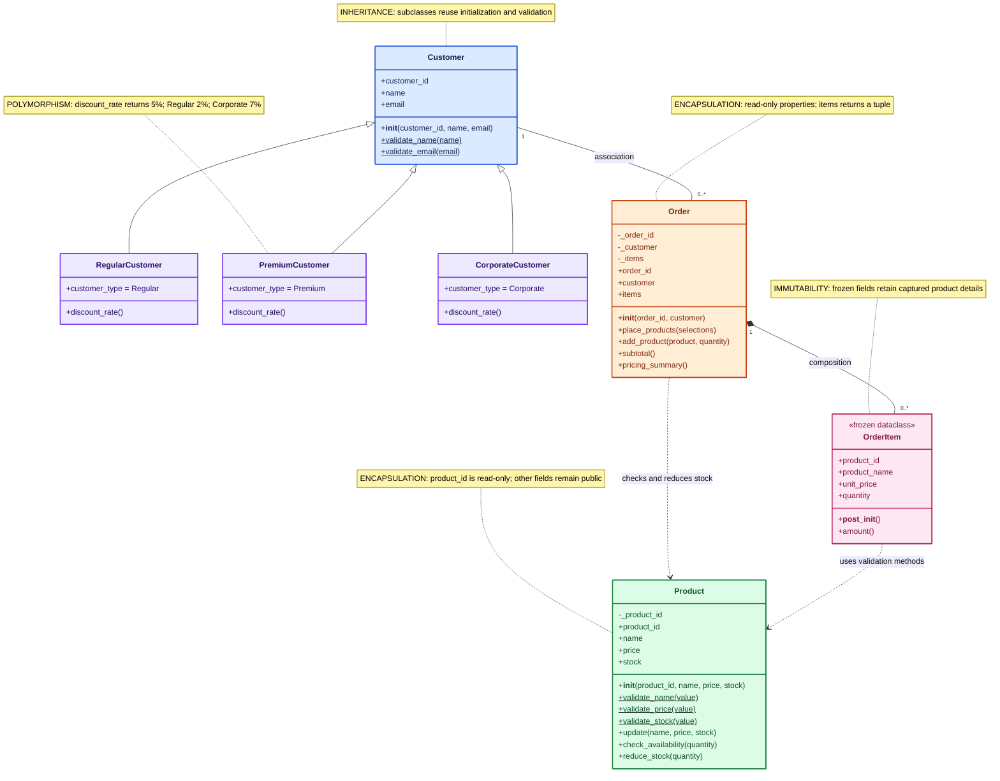
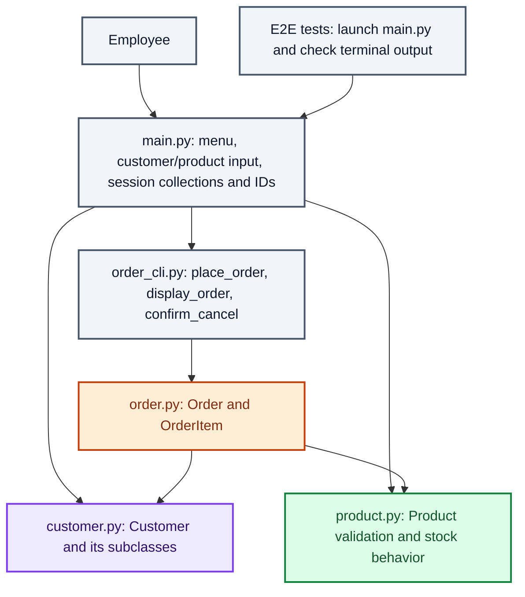

# Retail Order Management: OOP Design

This document describes the current implementation: create customers, create
products, and place an order containing multiple products. Entering `/done`
completes the order and displays its price. Data lasts for the current session.

## Class diagram

### Color key

| Color | Highlight |
|---|---|
| Blue | Customer base class and inheritance |
| Purple | Customer subclasses and polymorphism |
| Green | Product validation and controlled stock behavior |
| Orange | Order encapsulation and coordination |
| Pink | OrderItem composition and immutable snapshots |
| Gray | User interaction and supporting modules |

Colors emphasize each class's main role; a class can demonstrate several OOP
concepts. Labels and notes also identify the concepts without relying on color.



### Reading the notation

| Symbol | Meaning in this diagram |
|---|---|
| Hollow triangle toward Customer | Inheritance: each subclass is a Customer |
| Solid line | Association: an order references one customer |
| Filled diamond at Order | Composition: an order owns its items |
| Dashed arrow | Dependency: one class uses another |
| `+` | Public attribute, property, or method |
| `-` | Internal attribute by Python convention, not enforced private access |
| `$` after a method | Static method |
| `1` | Exactly one |
| `0..*` | Zero or more |

An Order starts empty while being constructed. The current placement flow saves
it only after at least one item has been added. OrderItem stores a product ID
and copies of its name and price, not a live Product reference.

## Modules and application responsibilities



`main.py` and `order_cli.py` are modules containing functions, not classes.
The menu exposes Create customer, Create product, Place order, and Exit.
Product.update and Order.add_product remain available in the model; the current
order CLI uses Order.place_products to submit all selected products together.

## How placing an order uses OOP

```mermaid
sequenceDiagram
    actor Employee
    participant Main as main.py
    participant CLI as order_cli.py
    participant Order
    participant Product
    participant Item as OrderItem
    participant Customer as Customer subclass
    Employee->>Main: Choose Place order
    Main->>CLI: place_order(id, customers, products)
    Employee->>CLI: Select customer; enter product names and quantities
    Note over CLI: Keep pending quantities; stock is unchanged
    Employee->>CLI: /done
    CLI->>Order: Construct order and call place_products(selections)
    rect rgb(252, 231, 243)
    Note over Order,Item: Composition and immutable snapshots
    Order->>Item: Create immutable snapshots
    end
    rect rgb(220, 252, 231)
    Note over Order,Product: Validate stock before committing
    Order->>Product: Check combined quantity for each product
    end
    rect rgb(237, 233, 254)
    Note over Order,Customer: Polymorphism selects the discount rate
    Order->>Customer: discount_rate()
    Customer-->>Order: Decimal rate determined by subclass
    end
    rect rgb(255, 237, 213)
    Note over Order,Product: Order coordinates the stock change
    Order->>Product: reduce_stock(quantity)
    end
    Order-->>CLI: Completed order
    CLI-->>Main: Return order
    Main->>Main: Store order and increment ID
    Main->>CLI: display_order(order)
    CLI->>Order: pricing_summary()
    Order->>Item: amount()
    Order->>Customer: discount_rate()
    Order-->>CLI: Subtotal, rate, rounded discount, final amount
    CLI-->>Employee: Display order and price
```

The sequence shows successful placement. Invalid input allows correction.
Cancellation discards pending selections without reducing stock. The model checks
combined quantities for repeated products and restores stock if committing the
order fails.

## OOP concepts to highlight during the presentation

| Concept | Example in the code | Explanation |
|---|---|---|
| Classes and objects | Product and each created product | A class defines structure and behavior; objects hold individual values. |
| Inheritance | RegularCustomer, PremiumCustomer, CorporateCustomer | They inherit Customer initialization and validation without repeating the constructor. |
| Polymorphism | customer.discount_rate() | The same call supplies 2%, 5%, or 7% depending on the subclass. |
| Encapsulation | Order.items and Product.product_id | Read-only properties limit accidental changes; Order exposes a tuple instead of its internal list. |
| Abstraction | Order.place_products() | The CLI requests placement without implementing stock commit and rollback details. No abstract base class or explicit interface is currently used. |
| Composition | Order owns OrderItem objects | Items are parts of their order and retain the details captured when added. |
| Association | Order.customer | The customer exists independently and can be associated with multiple orders. |
| Static methods | Product.validate_price() | Validation can run without creating an instance first. |
| Class attributes | customer_type on each subclass | Each subclass defines its shared type label. |
| Dataclass | OrderItem | Python generates initialization and other common methods; frozen=True prevents normal field reassignment. |

Money uses Decimal. Each item amount is captured unit price multiplied by
quantity. The subtotal sums all item amounts. The customer discount is rounded
once using ROUND_HALF_UP; final amount is subtotal minus that rounded discount.

## Current limitations

- Customer attributes and product name, price, and stock are publicly assignable.
  Direct assignment can bypass their validation methods: encapsulation is partial.
- An underscore is a Python convention, not a security boundary. Returning a
  customer reference does not make that customer immutable.
- The base Customer does not define discount_rate; the application selects one
  of the three subclasses that implements it.
- This is the current simplified flow. Earlier PBIs describe separate order
  creation, addition, and viewing screens; they have not all been revised to
  match it.

## Source files

- [Main menu and session storage](../main.py)
- [Customer classes](../src/customer.py)
- [Product class](../src/product.py)
- [Order and OrderItem](../src/order.py)
- [Order terminal interaction](../src/order_cli.py)

Open this file in a Markdown viewer with Mermaid support to render the diagrams.
